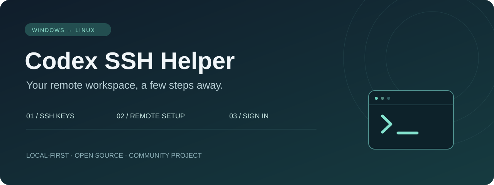
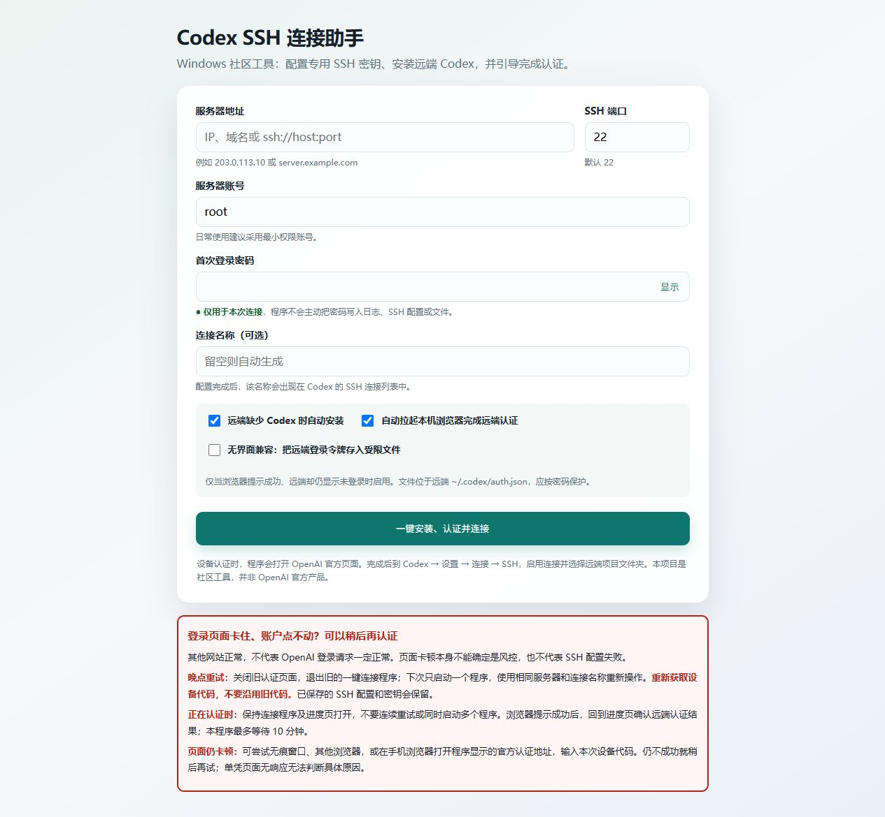

<p align="center"></p>

# Codex SSH Helper for Windows

Set up SSH keys, prepare remote Linux Codex, and complete device authorization from your Windows browser.

**[Download v0.2.0](https://github.com/keeperruner/codex-ssh-helper-windows/releases/tag/v0.2.0)** · [简体中文](README.md) · [Privacy](PRIVACY.md) · [Security](SECURITY.md)

An independent community project. Not an official OpenAI product or affiliated with OpenAI.

## What it does

- Creates or reuses Ed25519 keys and applies Windows file permissions.
- Requests server fingerprint confirmation before password authentication and public-key installation.
- Adds a managed SSH alias, preserving other entries and backing up changed configuration.
- Optionally installs Codex remotely and checks the login shell's PATH.
- Displays a device code and opens the official authorization page.
- Prints connection values for the desktop app.



## Quick start

1. Download the EXE and `SHA256SUMS.txt` from the release page. No separate Python installation is required.
2. Run `Get-FileHash .\Codex-SSH-Helper-Windows-v0.2.0.exe -Algorithm SHA256` in PowerShell and compare the checksum.
3. Open the EXE. Enter the server host, SSH port, username, initial password and an alias such as `my-linux`.
4. Verify the fingerprint through your server provider's console before continuing.
5. Complete device authorization if requested. Keep the helper open and check its final status.
6. Add or enable the SSH connection in your desktop app, then open a remote project folder.

| Desktop connection field | Value |
| --- | --- |
| Display name | The alias printed by the helper |
| Hostname | The same SSH alias, such as `my-linux` |
| Optional SSH port | Leave blank to use SSH configuration |
| Authentication | Identity file |
| Identity file path | The exact full path printed by the helper, ending in `_ed25519` |

Do not select `.pub` or `_known_hosts`. These instructions use example aliases only.

## Requirements and limits

Windows 10/11 x64 with OpenSSH Client; a desktop app offering SSH connections; a Linux target with password SSH, SFTP, `sh`, and `curl` or `wget`. Appropriate network access and account permissions are required. The user completes browser authorization.

The owner reports a successful trial on a second Windows computer. A detailed compatibility matrix is not yet available. The EXE is unsigned; verify its source and checksum if Windows shows an unknown-publisher warning.

## Privacy

There is no telemetry service. Authentication data goes to the server you select; installation and authorization use official services. The helper does not intentionally save your SSH password. Server details are stored in local SSH configuration; private keys stay on Windows. Progress logs and device codes appear locally and should be redacted before sharing. Optional remote file-based credential storage is off by default. See [PRIVACY.md](PRIVACY.md).

## Development

```powershell
python -m venv .venv
.\.venv\Scripts\python -m pip install -r requirements-dev.txt
.\.venv\Scripts\python app.py
.\.venv\Scripts\python -m pytest -q
.\.venv\Scripts\python -m PyInstaller --noconfirm --clean CodexRemoteSetup.spec
```

The workflow uses Python 3.10. Check [Actions](https://github.com/keeperruner/codex-ssh-helper-windows/actions/workflows/windows.yml) for actual CI results.

## Troubleshooting

If this tool saves you time, a Star is appreciated. Success reports and improvement suggestions are welcome too. Stars are never required to download or use it.

- **Host key verification failed:** use the generated alias and correct private key; verify changed server fingerprints with your provider. Do not disable host-key checking.
- **Codex not on PATH:** inspect the installation log and remote login-shell configuration. The v0.2.0 final check requires Codex even when automatic installation is deselected.
- **Authorization page unresponsive:** retry later with a new device code. This symptom alone does not establish account restriction.
- **New computer:** run setup again to create its local SSH configuration and keys.

See the [Chinese FAQ](FAQ.md). Submit redacted reports through [Issues](https://github.com/keeperruner/codex-ssh-helper-windows/issues). [MIT License](LICENSE).
